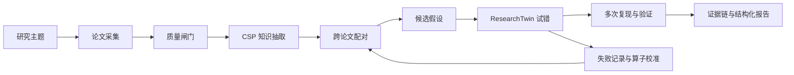

# Sci Host MCP

Sci Host MCP 是一个通过 Model Context Protocol（MCP）提供材料科学文献研究能力的本地服务。它把文献检索、质量筛选、知识抽取、跨论文配对、候选假设生成和可重复的候选验证组织成一个有状态的研究运行时，供 Claude、Cursor、VS Code Continue 或其他 MCP 客户端调用。

它的目标不是替研究者直接宣布“发现了新材料”，而是把大规模文献阅读转换成一组可检查、可追溯、可继续验证的研究候选：每个候选都应能回答“来自哪些论文、基于哪些组分-结构-性能关系、为什么值得尝试、怎样证伪”。

## 工作方式

一次研究运行从一个研究主题开始。系统保留运行状态，后续工具调用可以继续使用前一阶段的论文、知识片段、配对、假设和失败记录。



### 1. 采集与筛选

服务支持内置离线语料、arXiv、OpenAlex 和 Sciverse。每篇论文都会保留来源、论文 ID、标题、摘要和数据源标记。在线来源不可用或返回空结果时，系统会明确记录 `offline_fallback`，不会把离线内容伪装成在线检索结果。

研究质量闸门可以按研究主题筛掉只有元数据、缺少技术机制、没有可观测证据或与目标方向无关的论文。闸门的拒绝数量和原因会进入运行状态，便于检查检索质量。

### 2. CSP 知识抽取

材料模式把论文内容整理为 `Composition -> Structure -> Property` 知识片段，并保留数值、单位、论文 ID 和证据来源。抽取结果既可以由内置规则完成，也可以由 MCP 客户端阅读论文摘要后通过 Agent CSP 工具提交。

### 3. 跨论文配对

配对器在论文和 CSP 片段之间寻找相似、互补或跨领域的连接，例如把一个体系中的结构控制方法与另一个体系中的目标性能联系起来。配对结果包含两篇源论文、匹配关键词、相似度和跨领域标记，后续假设可以直接引用这些关系。

### 4. 候选假设

假设生成器将论文配对和 CSP 片段组合为候选构效关系、组分迁移、隐藏关联或 Research Gap 填补假设。输出包含材料、结构、工艺或性能字段，以及预测区间、源论文和可证伪条件。它是研究候选，不等同于已经发表或实验确认的结论。

### 5. ResearchTwin 试错

`ResearchTwin` 是仓库内置的轻量研究状态运行时。它把论文集合、CSP 知识、假设池、验证结果、方向置信度和失败记忆放在同一个状态中。`TrialEngine` 对每个候选调用多个评估算子，检查预测一致性、物理范围、文献交叉证据、新颖性和可合成性，并记录通过或失败的原因。

这里的“仿真”是候选排序和一致性筛选机制，不是 DFT、分子动力学、有限元或真实实验。通过结果仍然需要独立计算、数据库核验或实验验证。

验证阶段可以对候选重复运行，将复现率、稳定性、证据完整性和可信度标签写入报告。Agent 可以在分阶段研究中提交关注论文、关注配对或方向建议；Agent 的强制判断会被单独标记为覆盖结果，不会伪装成自动验证。

## 运行结果包含什么

一个完整候选通常包含以下信息：

- 研究假设和假设类型；
- 材料组分、结构、目标性质、预测范围和工艺线索；
- 源论文 ID、标题、数据源和论文配对关系；
- CSP 知识片段及其证据字段；
- 每个评估算子的预测、总分、一致性和失败原因；
- 重复验证的结果、复现率和可信度说明；
- Research Gap、候选新颖性和下一步验证建议。

因此，系统输出可以被研究者逐项审阅，而不是只能查看一个没有来源的自然语言结论。

## 安装

要求 Python 3.10 或更高版本。

```bash
git clone https://github.com/aceris-sola/sci-host-mcp.git
cd sci-host-mcp
python3 -m venv .venv
source .venv/bin/activate
python -m pip install -U pip
python -m pip install -e ".[mcp,dev]"
```

只运行离线 Python 流程时，可以省略 `[mcp]`；只作为 MCP 服务使用时，可以省略 `[dev]`。

## 本地验证

先用内置材料语料验证安装和算法链路：

```bash
python -m sci_host.run --materials --single-step
python -m pytest -q
```

启动 MCP 服务：

```bash
python -m sci_host.mcp_server
```

服务默认使用 stdio。需要 HTTP 入口时：

```bash
python -m sci_host.mcp_server --http 8080
```

## MCP 客户端接入

在 MCP 客户端中加入以下配置，把 `cwd` 替换为本地仓库路径：

```json
{
  "mcpServers": {
    "sci-host": {
      "command": "python3",
      "args": ["-m", "sci_host.mcp_server"],
      "cwd": "/path/to/sci-host-mcp",
      "env": {
        "SCIVERSE_API_TOKEN": "由本机环境注入"
      }
    }
  }
}
```

也可以在虚拟环境中安装命令后使用 `"command": "sci-host-mcp"`。完整说明见 [MCP_CONFIG.md](MCP_CONFIG.md)。

## 一次真实的研究调用

下面是推荐的分阶段调用方式。每一步都读取上一步写入的运行状态，返回论文、配对、假设或验证数据；这是一条可观察的研究工作流，不是预先写死的演示结果。

### 创建材料研究运行

离线回归测试：

```json
{
  "tool": "sci_create_materials_host",
  "arguments": {
    "host_id": "materials-local",
    "offline": true,
    "batch_size": 20,
    "research_seeds": ["thermoelectric materials", "structure property relationship"]
  }
}
```

使用 Sciverse：

```bash
export SCIVERSE_API_TOKEN="your-token"
```

然后调用 `sci_create_sciverse_host`，并传入 `host_id`、`batch_size` 和研究关键词。Token 只应存在于进程环境或客户端密钥管理中。

### 执行完整循环

调用 `sci_step` 会依次执行：采集论文、质量筛选、CSP 抽取、论文配对、假设生成、试错、知识积累和方向更新。适合批处理或不需要人工介入的运行。

### 逐阶段观察和介入

需要让 Agent 在每一阶段检查结果时，按以下顺序调用：

```text
sci_stream_crawl
  -> sci_stream_pair
  -> sci_stream_hypothesize
  -> sci_stream_trial
  -> sci_stream_verify
```

在阶段之间可以调用 `sci_stream_feedback`，提交需要深入的论文 ID、配对 ID、假设 ID、方向建议或明确的判断。返回结果会标出数据源、当前阶段、下一步、论文/配对/假设数量和验证摘要。

### 查询和导出

运行过程中可以使用：

- `sci_get_status` 查看当前阶段、数量、失败数和数据源；
- `sci_get_csp_knowledge` 查询组分-结构-性能知识；
- `sci_get_gap_evidence` 查看带论文证据的 Research Gap；
- `sci_get_verification` 查看单个假设的每次复现；
- `sci_get_discovery_report` 导出带溯源链的 Markdown 研究报告；
- `sci_run_structure_property_search` 对已有假设和 CSP 片段做构效关系候选搜索；
- `sci_validate_external_databases` 使用已配置的外部数据库进行交叉核验。

## 工具分组

- 运行管理：`sci_create_host`、`sci_create_materials_host`、`sci_create_sciverse_host`、`sci_get_info`、`sci_list_hosts`、`sci_remove_host`。
- 研究循环：`sci_step`、`sci_run_cycles`、`sci_get_status`、`sci_get_snapshot`。
- 文献与知识：`sci_add_paper`、`sci_get_pairs`、`sci_get_csp_knowledge`、`sci_get_graph`、`sci_get_top_validated`、`sci_get_failures`。
- Agent 协作：`sci_get_papers_for_csp`、`sci_submit_csp`、`sci_step_agent`、`sci_stream_feedback`。
- 分阶段研究：`sci_stream_crawl`、`sci_stream_pair`、`sci_stream_hypothesize`、`sci_stream_trial`、`sci_stream_verify`。
- 报告与验证：`sci_get_gap_evidence`、`sci_get_literature_review`、`sci_get_discovery_report`、`sci_run_structure_property_search`、`sci_validate_external_databases`。

## Demo

打开 [demo/research-workflow-demo.html](demo/research-workflow-demo.html) 可以查看一个静态交互页面。页面展示的是研究状态如何沿着“检索、抽取、配对、假设、试错、报告”变化，页面内的指标和日志是用于观察界面的示例数据，不代表一次真实的 Sciverse 响应。

真实运行应以 MCP 工具返回的论文 ID、数据源、证据链、试错结果和验证记录为准。Demo 不会替代 MCP 服务，也不会把静态内容伪装成在线调用。

## 数据源和可信度边界

- 离线模式使用仓库内置语料，适合安装验证、回归测试和界面展示。
- arXiv、OpenAlex 和 Sciverse 模式依赖网络和对应服务的当前响应。
- Sciverse Token 缺失、无效或请求失败时，系统会返回明确的数据源状态，并可能使用离线回退；请检查返回的 `data_source` 和 `offline_fallback_crawls`。
- ResearchTwin 的试错分数表示候选在当前评估算子下的一致性，不代表材料已经合成或性质已经测量。
- 任何“新颖”或“可行”候选都应回到原论文、外部数据库、DFT/MD 或实验流程中复核。

## 安全与发布边界

不要把 `SCIVERSE_API_TOKEN`、LLM 密钥、数据库密钥、运行日志或本机绝对路径写入代码和 Git。推荐使用 MCP 客户端的 `env`、操作系统密钥环或 CI secret。发布前可以检查：

```bash
git grep -n -I -E 'github_pat_|sk-[A-Za-z0-9_-]{20,}|sci_[A-Za-z0-9]{20,}'
```

没有输出只表示仓库文本没有匹配到这些常见格式，不能替代平台侧的 secret scanning。

## 许可

Apache-2.0，见 [LICENSE](LICENSE)。
